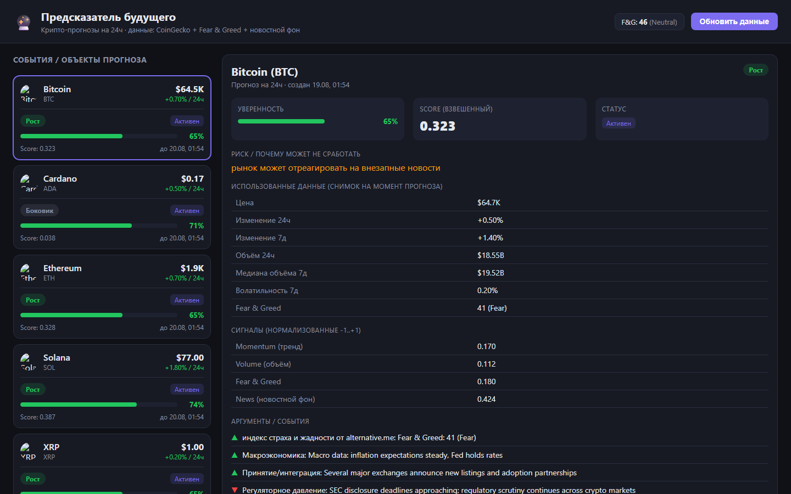
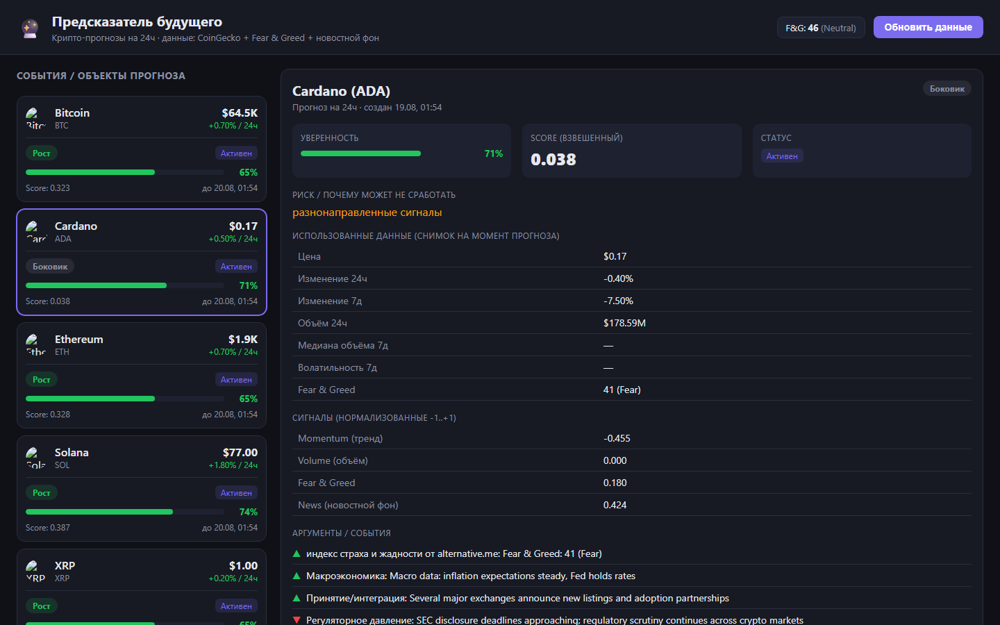

# 🔮 Предсказатель будущего — крипто-прогнозы на 24 часа

Прототип «предсказателя будущего» для тестового задания. Система строит краткосрочные прогнозы направления цены топ-криптовалют на 24 часа на основе **реальных данных из нескольких источников**, объясняет каждый вывод и **сама проверяет, где ошиблась**.

> ⚠️ Демо-прототип. Прогнозы носят информационный характер, не являются инвестиционной рекомендацией. Реальные деньги и ставки не используются.

---

## 1. Выбранная тема

**Крипторынок: прогноз направления цены (рост / падение / боковик) на 24 часа** для топ-5 монет по капитализации: Bitcoin, Ethereum, Solana, XRP, Cardano.

Почему эта тема: у неё есть открытые бесплатные API с ценами, объёмами и настроением рынка, а результат прогноза можно объективно проверить по фактическому движению цены — это позволяет системе «понимать, что ошиблась».

---

## 2. Источники данных (2+ реальных)

| Источник | Тип | Что даёт |
|---|---|---|
| **CoinGecko API** (`/coins/markets`) | API | Цены, объёмы 24ч, капитализация, изменение за 24ч и 7д |
| **CoinGecko API** (`/market_chart`, 7 дней) | API | Почасовая история цен и объёмов → волатильность, медиана объёма |
| **Fear & Greed Index** (alternative.me) | API | Индекс настроения рынка 0..100 (строится на новостях, соцсетях, волатильности, объёмах, опросах) |
| **Новостные триггеры (локальный словарь)** | local | Категории новостного фона с тональностью (ETF, хакеры, регуляторика, принятие, макро) |

> Примечание: прямые RSS-ленты новостей (CoinDesk, CoinTelegraph) в среде тестового задания оказались недоступны (таймаут/блокировка), поэтому новостной сигнал реализован как локальный словарь категорий с тональностью, а «настроение рынка» дополнительно берётся из реального индекса Fear & Greed. Это честно описано в коде и в интерфейсе.

---

## 3. Как устроена база данных (SQLite)

Файл БД: `data/forecaster.db` (создаётся автоматически). Используется встроенный `node:sqlite` — **никаких внешних СУБД не нужно**.

| Таблица | Назначение |
|---|---|
| `coins` | Справочник монет (id, name, symbol, image) |
| `sources` | Справочник источников данных |
| `raw_records` | **Сырые** ответы источников (JSON) с меткой времени |
| `metrics` | **Нормализованные** показатели: price, volume_24h, market_cap, change_24h/7d, volume_median_7d, volatility_7d, fng_value |
| `events` | События/аргументы (новости, настроение) с направлением и весом |
| `forecasts` | Прогнозы: направление, уверенность, score, риск, снимок входных данных (`inputs_json`), аргументы (`events_json`) |
| `outcomes` | Результаты сверки прогноза с фактической ценой (hit/miss/expired) |
| `update_history` | История обновлений (fetch / forecast / resolve) |

**Сходимость цифр:** прогноз считается **только** из данных, сохранённых в `metrics` и `events`. В `forecasts.inputs_json` хранится полный снимок показателей на момент прогноза — поэтому любой прогноз можно воспроизвести и проверить.

---

## 4. Как работает алгоритм (scoring с весами)

Прогноз — **детерминированная функция** (никакой случайности). Каждый показатель нормализуется в сигнал `-1..+1`, затем берётся взвешенная сумма:

```
score = 0.30·momentum + 0.20·volume + 0.20·fng + 0.15·volatility + 0.15·news
```

| Сигнал | Вес | Как считается |
|---|---|---|
| **Momentum** | 0.30 | изменение 24ч (±3% → ±1) и 7д (±8% → ±1) |
| **Volume** | 0.20 | лог-отношение объёма 24ч к медиане объёма за неделю |
| **Fear & Greed** | 0.20 | жадность (100) → перегрев/коррекция; страх (0) → возможный отскок |
| **Volatility** | 0.15 | высокая волатильность → риск, сдвиг к боковику |
| **News** | 0.15 | сумма тональностей новостных событий / √n |

**Направление** по порогам score:
- `score > +0.15` → **Рост**
- `score < -0.15` → **Падение**
- иначе → **Боковик**

**Уверенность** (0..1) растёт с силой сигнала и числом активных сигналов (сигмоида, ограничена 0.05..0.95).

**Риск** формируется из правил: высокая волатильность, разнонаправленные сигналы, недостаток новостного фона, внезапные новости.

### Как система понимает, что ошиблась

После истечения горизонта (24ч) `resolveForecasts()` берёт фактическую цену из БД и сравнивает с ценой на момент прогноза:
- `up` → сбылся, если цена выросла; `down` → если упала; `flat` → если |изменение| ≤ 1%.
- Результат пишется в `outcomes`, статус прогноза меняется на `hit`/`miss`, и это учитывается в **статистике точности** на дашборде.

---

## 5. Структура проекта

```
backend/
  index.js          # HTTP API (Express) + раздача собранного клиента
  db.js             # SQLite: схема + миграции
  store.js          # слой доступа к данным
  sources.js        # CoinGecko + Fear & Greed (retry, таймауты)
  news.js           # локальный словарь новостных триггеров
  engine.js         # scoring-модель (веса, нормализация, уверенность, риск)
  pipeline.js       # оркестрация: fetch → нормализация → прогноз → резолв
  scripts/refresh-once.js  # разовый прогон без сервера
frontend/
  src/App.jsx       # дашборд, список монет, карточка прогноза
  src/api.js        # клиент API + форматирование
  src/styles.css
```

---

## 6. Как запустить

Требуется **Node.js ≥ 22.5** (используется встроенный `node:sqlite`).

```bash
# 1. Сервер
cd backend
npm install
npm start            # API на http://localhost:4000

# 2. Клиент (в отдельном терминале)
cd frontend
npm install
npm run build        # соберёт статику в frontend/dist
# либо для разработки: npm run dev (Vite на :5173, CORS уже настроен)
```

Сервер сам раздаёт собранный клиент из `frontend/dist`, поэтому достаточно открыть **http://localhost:4000**.

### Разовый прогон данных без сервера

```bash
cd backend
npm run refresh      # fetch источников → прогнозы → резолв
```

---

## 7. Какие цифры должны сходиться

- **Score** в карточке = взвешенная сумма сигналов из таблицы «Сигналы» (можно пересчитать вручную по весам).
- **Направление** определяется порогами score (см. выше).
- **Уверенность** растёт с |score| и числом активных сигналов.
- **Снимок данных** в карточке совпадает с `metrics` в БД на момент прогноза.
- **Точность** на дашборде = сбывшиеся / завершённые прогнозы из `outcomes`.

---

## 8. Что использовано из AI / технологий

- **AI-модели не используются** — прогноз строится на детерминированной scoring-модели с явными весами и правилами. Это сделано намеренно: логика полностью объяснима и воспроизводима.
- **Библиотеки:** Express (API), React + Vite (интерфейс), встроенный `node:sqlite` (БД).
- **Открытые источники:** CoinGecko API, Fear & Greed Index (alternative.me).

---

## 9. Скриншоты интерфейса

**Дашборд** — список монет с прогнозами и карточка выбранной монеты (Bitcoin):



**Карточка прогноза Cardano** — пример направления «Боковик» с сигналами и аргументами:



> Скриншоты сделаны с реальными данными из CoinGecko и Fear & Greed Index. Чтобы открыть карточку конкретной монеты, используйте хэш в адресе, например `http://localhost:4000/#cardano`.
